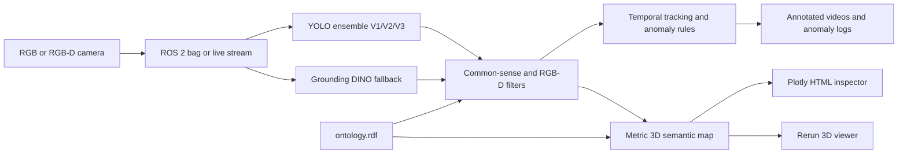

# Cognitive Recognition Framework

Computer-vision and spatial-reasoning software for surveillance of hospital environments using mobile robots. The project combines RGB and RGB-D perception, hospital-object detection, temporal tracking, anomaly rules, metric 3D reconstruction, ontology-backed semantic knowledge, and visual inspection tools.

The framework is intended for a mobile robot carrying an RGB-D camera. A recorded ROS 2 bag can be replayed offline, or the same processing stages can be adapted to an online sensor stream.

## Project Goals

The system is designed to help a mobile robot:

- Observe hospital corridors, rooms, equipment, people, signs, and hazards.
- Detect hospital-specific objects in RGB images and video.
- Recover metric object positions from aligned RGB-D data.
- Track observations over time and maintain a spatial memory.
- Detect safety anomalies such as blocked emergency exits, spills, and unauthorized access.
- Use Grounding DINO for open-vocabulary or weak-class detection when the trained YOLO models are insufficient.
- Apply depth and physical-size checks to reject geometrically implausible detections.
- Connect detected objects to an ontology and expose semantic information in map viewers.
- Record evidence, timestamps, confidence, and spatial context for later review.

## Architecture



The repository is organized by development stage:

| Folder | Purpose |
| --- | --- |
| `01_codebase/01_training` | Dataset preparation and model training scripts |
| `01_codebase/02_inference` | Image, video, ensemble, and HospitalGuard inference |
| `01_codebase/03_data_preparation` | Dataset download, merge, split, and class definitions |
| `01_codebase/04_rgbd_and_spatial_twin` | RGB-D processing, spatial memory, and temporal tracking |
| `01_codebase/05_experiments_and_analysis` | Comparisons, evaluation, and presentation generation |
| `01_codebase/06_anomaly_detection` | Blocked-exit, spillage, and unauthorized-access detection |
| `01_codebase/07_object_detection` | Shared YOLO/DINO detector and RGB-D filtering utilities |
| `01_codebase/08_semantic_map` | Persistent semantic map and viewers, on the `semantic-map` branch |
| `01_codebase/09_ontology` | RDF/OWL knowledge base, on the `ontology` branch |
| `02_datasets` | Datasets and ROS 2 RGB-D bag recordings |
| `03_models_and_weights` | YOLO and anomaly-detection weights |
| `04_outputs_runs_and_logs` | Generated videos, maps, logs, and validation results |
| `07_environment_and_project_meta` | Environment notes and dependency files |
| `10_Testing` | Focused regression tests |

## Git Branches

`main` contains the established detector, RGB-D development, and anomaly-detection baseline. The semantic-map and ontology implementation was developed on dedicated branches:

- `main`: baseline detector and anomaly workflows.
- `semantic-map`: persistent SQLite semantic map, Rerun logger, HTML viewer, and RGB-D bag map builder.
- `ontology`: RDF/OWL ontology, shared ontology resolver, RDF exporter, and ontology documentation.
- `blocked-exit-detection`: blocked-exit v2 integration with per-frame obstruction events and tests.

To inspect a feature branch:

```powershell
git fetch origin
git switch semantic-map
# or
git switch ontology
# or
git switch blocked-exit-detection
```

The paths referenced in the feature sections below are therefore branch-dependent. The files are available in GitHub on the named branch even when they are not present on the current `main` checkout.

## Environment Setup

The project is developed on Windows with Python 3.11. A prepared environment is available locally as:

```text
07_environment_and_project_meta/.venv-gpu311/
```

Use the project interpreter rather than the system Python:

```powershell
$Python = ".\07_environment_and_project_meta\.venv-gpu311\Scripts\python.exe"
& $Python --version
```

Install the main dependencies from the appropriate requirements file when available, or install the core packages directly:

```powershell
& $Python -m pip install ultralytics torch torchvision opencv-python numpy pillow transformers rosbags rerun-sdk openpyxl matplotlib plotly rdflib
```

For a shorter setup, split this into multiple `pip install` commands.

CUDA is recommended for YOLO and Grounding DINO. CPU fallback is supported by some scripts but is substantially slower. The Grounding DINO model may download from Hugging Face on first use.

## Models

### V1: Hospital and COCO Model

GitHub path:

- Weight: [`03_models_and_weights/models/yolo_trained_v1.pt`](03_models_and_weights/models/yolo_trained_v1.pt)
- Class reference: [`01_codebase/03_data_preparation/hospital_model_classes.txt`](01_codebase/03_data_preparation/hospital_model_classes.txt)

V1 contains 106 classes:

- The 80 COCO classes: `person`, `bicycle`, `car`, `motorcycle`, `airplane`, `bus`, `train`, `truck`, `boat`, `traffic light`, `fire hydrant`, `stop sign`, `parking meter`, `bench`, `bird`, `cat`, `dog`, `horse`, `sheep`, `cow`, `elephant`, `bear`, `zebra`, `giraffe`, `backpack`, `umbrella`, `handbag`, `tie`, `suitcase`, `frisbee`, `skis`, `snowboard`, `sports ball`, `kite`, `baseball bat`, `baseball glove`, `skateboard`, `surfboard`, `tennis racket`, `bottle`, `wine glass`, `cup`, `fork`, `knife`, `spoon`, `bowl`, `banana`, `apple`, `sandwich`, `orange`, `broccoli`, `carrot`, `hot dog`, `pizza`, `donut`, `cake`, `chair`, `couch`, `potted plant`, `bed`, `dining table`, `toilet`, `tv`, `laptop`, `mouse`, `remote`, `keyboard`, `cell phone`, `microwave`, `oven`, `toaster`, `sink`, `refrigerator`, `book`, `clock`, `vase`, `scissors`, `teddy bear`, `hair drier`, `toothbrush`.
- The 26 hospital classes: `cabinet`, `glove`, `healthcare_worker`, `hospital_bed`, `infusion_pump`, `iv_bag`, `iv_stand`, `monitor_hosp`, `nasal_cannula`, `patient`, `patient_monitor`, `surgical_light`, `test_tube`, `vending_machines`, `wheelchair`, `bench_hosp`, `door`, `reception_counter`, `radiator`, `bathroom_labels`, `fire_extinguisher`, `hospital_stretcher`, `security_camera`, `hair_net`, `mask`, `surgical_scissor`.

### V2: Focused Hospital Hazard/Object Model

GitHub path:

- Weight: [`03_models_and_weights/yolo_trained_v2.pt`](03_models_and_weights/yolo_trained_v2.pt)

V2 identifies these 12 classes:

`bin`, `door`, `electrical_cabinet`, `exit_sign`, `glove`, `hair_net`, `hand_sanitizer`, `hazmat_sign`, `mask`, `security_camera`, `test_tube`, `wet_floor_sign`.

V2 is useful for focused hospital-sign, PPE, infrastructure, and hazard-object detection. Its `bin` class is refined by the bin-classification stage where that workflow is enabled.

### V3: Expanded Hospital Model

GitHub path:

- Weight: [`03_models_and_weights/models/yolo_trained_v3.pt`](03_models_and_weights/models/yolo_trained_v3.pt)
- Class reference: [`01_codebase/03_data_preparation/hospital_model_classes.txt`](01_codebase/03_data_preparation/hospital_model_classes.txt)

V3 contains 109 classes: all 106 V1 classes plus:

`bag`, `exit_sign`, `spillage`.

The shared V1/V3 ensemble routes overlapping classes through NMS and uses V3 for the new classes. The principal implementation is [`01_codebase/07_object_detection/YOLO_ensemble+DINO.py`](01_codebase/07_object_detection/YOLO_ensemble%2BDINO.py), while the image ensemble is [`01_codebase/02_inference/infer_ensemble.py`](01_codebase/02_inference/infer_ensemble.py).

### Model Paths in the Detector

The shared detector currently declares:

```text
V1: 03_models_and_weights/models/yolo_trained_v1.pt
V2: 03_models_and_weights/yolo_trained_v2.pt
V3: 03_models_and_weights/models/yolo_trained_v3.pt
```

Some historical inference scripts use paths under `outputs/runs/`. Check the script constants before running an older workflow.

## Grounding DINO

Grounding DINO is an open-vocabulary detector used as a fallback and contextual verifier. The project uses:

```text
IDEA-Research/grounding-dino-base
```

Configuration is maintained in [`01_codebase/07_object_detection/dino_prompts.py`](01_codebase/07_object_detection/dino_prompts.py) and in some older HospitalGuard scripts.

The workflow is:

1. Run the trained YOLO model or ensemble.
2. Determine which hospital targets are missing or require verification.
3. Query Grounding DINO with a class-specific natural-language phrase.
4. Apply a per-class confidence threshold.
5. Combine detections with NMS and project valid RGB-D detections into 3D when depth is available.

The prompts are deliberately specific, for example surgical light, medical tray, IV stand, exit sign, hazmat sign, and hospital door. Some classes are queried in isolation because similar words or visual features can confuse batched open-vocabulary inference. Context gates can require hospital anchors such as a healthcare worker, hospital bed, IV equipment, or PPE before accepting a weak-class DINO result.

Grounding DINO does not replace the trained YOLO models. It supplements classes affected by domain shift, small targets, weak YOLO recall, or classes that are not present in a particular YOLO vocabulary.

## Shared RGB/RGB-D Detection Pipeline

The main shared entry point is [`01_codebase/07_object_detection/YOLO_ensemble+DINO.py`](01_codebase/07_object_detection/YOLO_ensemble%2BDINO.py). Supporting modules are:

- [`common_sense_filter.py`](01_codebase/07_object_detection/common_sense_filter.py): rule-based rejection of implausible detections.
- [`bin_classifier.py`](01_codebase/07_object_detection/bin_classifier.py): bin subtype refinement.
- [`dino_fallback.py`](01_codebase/07_object_detection/dino_fallback.py): Grounding DINO inference.
- [`rgbd_3d_filter.py`](01_codebase/07_object_detection/rgbd_3d_filter.py): depth-based geometry and physical-size filtering.
- [`rgbd_bag_processing.py`](01_codebase/07_object_detection/rgbd_bag_processing.py): RGB-D replay support.

A typical image or video detector produces annotated media under `04_outputs_runs_and_logs/OD_Outputs` or the output directory defined by the individual script.

## Physical-Size Reasoning

The RGB-D filter back-projects valid depth pixels inside a detection box into 3D. It estimates an oriented width and height using depth points and PCA, then compares the result with class-specific metric limits.

On `main`, the gate reads [`hospital_object_dimensions_approx.yaml`](01_codebase/07_object_detection/hospital_object_dimensions_approx.yaml). It is enabled by default for the configured bin physical gate and spillage floor gate. A detection is retained when its measured dimensions fall within the configured class range. Generic names such as `bin` can map to multiple candidate size profiles.

On the `ontology` and `semantic-map` branches, structured `physicalDimensions` annotations in `ontology.rdf` are used as the knowledge authority. The same normalized dimension knowledge is exposed to the object detector, semantic-map HTML inspector, Rerun metadata, and RDF export. This prevents the viewer and the RGB-D gate from silently using different size assumptions.

Depth and size reasoning is a rejection aid, not a replacement for visual detection. If there are too few valid depth points, the filter leaves the detection unchanged rather than inventing a measurement.

## ROS 2 Bags and RGB-D Processing

A ROS 2 bag directory normally contains `metadata.yaml` and one or more `.db3` files. The RGB-D readers use `rosbags` and synchronize:

- RGB image: `/camera/rgb/image_rect_color`
- Depth image: `/camera/depth_registered/image_raw`
- Camera calibration: `/camera/rgb/camera_info`
- Robot odometry: `/odom`
- Dynamic transforms: `/tf`
- Static transforms: `/tf_static`

Use a bag directory, not an individual image, when running the RGB-D pipelines.

Example bag smoke check:

```powershell
$Python = ".\07_environment_and_project_meta\.venv-gpu311\Scripts\python.exe"
& $Python ".\01_codebase\04_rgbd_and_spatial_twin\hospital_detector_longterm\rgbd_development\scripts\rgbd_spatial_twin.py" `
  --sequence-root ".\01_codebase\04_rgbd_and_spatial_twin\hospital_detector_longterm\rgbd_development\data\rgbd_dataset_freiburg1_xyz" `
  --no-db --max-frames 30
```

For a ROS bag, use the bag-specific reader or the semantic-map branch builder. Always verify the topic names in `metadata.yaml` before changing defaults.

## Anomaly Detection

### Blocked Emergency Exit

The blocked-exit workflow combines YOLO, Grounding DINO, optional SAM segmentation, RGB-D depth, and a geometric keep-clear zone in front of a detected door or exit.

Main files:

- [`door_zone_rgbd.py`](01_codebase/06_anomaly_detection/Blocked_exit_detection/door_zone_rgbd.py): RGB-D door zone geometry and rendering.
- [`Door-exit_Detect.py`](01_codebase/06_anomaly_detection/Blocked_exit_detection/Door-exit_Detect.py): door/exit detection.
- [`Obstruction_detection.py`](01_codebase/06_anomaly_detection/Blocked_exit_detection/Obstruction_detection.py): obstruction decision workflow.
- [`RGBD_Reader.py`](01_codebase/06_anomaly_detection/Blocked_exit_detection/RGBD_Reader.py): synchronized RGB-D bag reader.

Example:

```powershell
$Python = ".\07_environment_and_project_meta\.venv-gpu311\Scripts\python.exe"
& $Python ".\01_codebase\06_anomaly_detection\Blocked_exit_detection\door_zone_rgbd.py" `
  --bag ".\02_datasets\saxon\hallway 1"
```

The branch-specific v2 semantic-map monitor is in `01_codebase/06_anomaly_detection/Blocked_exit_detection/v2/exit_obstruction.py` on `blocked-exit-detection`. It persists per-frame egress obstruction events and can be tested with `10_Testing/test_exit_obstruction_v2.py`.

### Spillage

Spillage workflows combine RGB/DINO detection, floor or position checks, dwell-time logic, and alert output. Start with [`detect_dwelled_spillage.py`](01_codebase/06_anomaly_detection/spillage_detection/detect_dwelled_spillage.py) or the temporal HospitalGuard implementation under `01_codebase/06_anomaly_detection/Spillage detection`.

### Unauthorized Access

[`Unauthorized_access.py`](01_codebase/06_anomaly_detection/Unauthorized_access.py) detects and classifies roles using YOLO person detection plus Grounding DINO crop verification. It distinguishes roles such as healthcare worker, patient, doctor, and general person according to the script configuration.

## Ontology and Semantic Map

The ontology is the semantic knowledge layer for hospital objects, roles, hazards, events, locations, hierarchy, relationships, and physical dimensions.

The ontology branch contains:

- `01_codebase/09_ontology/ontology.rdf`: RDF/XML ontology authority.
- `01_codebase/09_ontology/ontology_knowledge.py`: shared class resolver and normalized knowledge records.
- `01_codebase/09_ontology/semantic_map_to_rdf.py`: SQLite semantic-map to RDF bridge.

The semantic-map branch contains:

- `01_codebase/08_semantic_map/build_semantic_map_from_bag.py`: RGB-D bag to persistent map.
- `01_codebase/08_semantic_map/edit_world_map.py`: interactive landmark deletion and renaming.
- `01_codebase/08_semantic_map/view_semantic_map.py`: map loading and viewer entry point.
- `01_codebase/08_semantic_map/semantic_map_html.py`: self-contained Plotly HTML inspector.
- `01_codebase/08_semantic_map/rerun_logger.py`: Rerun 3D scene and landmark metadata logging.

The semantic-map database is the persistent source of truth. Same-class detections within the configured merge radius are merged into an existing landmark; detections outside the radius become new landmarks. Raw observations and camera poses are retained for later temporal reasoning.

For a feature-branch checkout:

```powershell
git switch semantic-map
$Python = ".\07_environment_and_project_meta\.venv-gpu311\Scripts\python.exe"
& $Python ".\01_codebase\08_semantic_map\build_semantic_map_from_bag.py" `
  --bag ".\02_datasets\saxon\rgbd_clean_20260521_142555" `
  --frame-stride 3
```

The current HTML map is written as one fixed file per bag:

```text
04_outputs_runs_and_logs/outputs/semantic_maps/<bag-name>/semantic_map_ontology.html
```

Select a landmark in the HTML viewer to inspect map evidence, ontology class, hierarchy, comments, properties, and physical dimensions.

## Rerun Viewer

Rerun has two different roles:

- Live Rerun session: can receive incremental logs over gRPC while a process is running.
- `.rrd` file: a closed recording snapshot; it cannot be appended to in place.

The persistent database and HTML viewer are therefore the current state, while `.rrd` is an explicit visualization export. On the semantic-map branch:

```powershell
$Python = ".\07_environment_and_project_meta\.venv-gpu311\Scripts\python.exe"
& $Python ".\01_codebase\08_semantic_map\build_semantic_map_from_bag.py" `
  --bag ".\02_datasets\saxon\rgbd_clean_20260521_142555" `
  --frame-stride 3 --rerun `
  --rerun-cloud-stride 10 --rerun-cloud-every 10

$Rerun = ".\07_environment_and_project_meta\.venv-gpu311\Scripts\rerun.exe"
& $Rerun ".\04_outputs_runs_and_logs\outputs\semantic_maps\rgbd_clean_20260521_142555\world_map.rrd"
```

The full snapshot can contain:

- RGB camera images.
- Annotated RGB images with detector boxes and labels.
- Accumulated RGB-D cloud points.
- Camera trajectory.
- 3D landmark points and boxes.
- Ontology metadata attached to landmark entities.

Cloud points come from replayed depth frames. A landmark deletion changes the semantic map, not the already-recorded physical cloud geometry. For large time-based deployments, use live Rerun logging or periodic snapshots rather than exporting a complete `.rrd` after every edit.

## Outputs and Viewing

Common outputs include:

- Annotated MP4 videos under `04_outputs_runs_and_logs`.
- Excel, CSV, and JSON detection logs.
- SQLite spatial-memory databases.
- Plotly self-contained HTML map viewers.
- Rerun `.rrd` snapshots.
- RDF/OWL semantic-map exports.

For HTML, open the generated `semantic_map_ontology.html` in a browser. For Rerun, open the `.rrd` with the project `rerun.exe` or the installed Rerun application. If port `9876` is already in use, an existing Rerun server is running; load the file in a separate viewer or close the old session before starting a new live server.

## Testing

Focused tests should be run with the project interpreter:

```powershell
$Python = ".\07_environment_and_project_meta\.venv-gpu311\Scripts\python.exe"
& $Python -m unittest discover -s 10_Testing -p "test_*.py" -v
```

Feature-branch semantic-map tests cover ontology resolution, HTML generation, Rerun metadata, and landmark path stability. The blocked-exit v2 branch adds CPU-only geometry tests.

## Operational Notes

- Keep large datasets, local virtual environments, generated videos, and run outputs out of ordinary source commits unless they are intentionally versioned.
- Use relative paths when sharing commands; historical scripts may contain machine-specific absolute paths that need adjustment.
- Confirm CUDA availability before starting Grounding DINO or large YOLO runs.
- Confirm ROS bag topics and camera calibration before interpreting 3D coordinates.
- Treat ontology dimensions as approximate physical priors and tune ranges with measured hospital data.
- Keep current map state in SQLite and use Rerun files as snapshots, because closed `.rrd` files are not appendable.

## License and Research Status

This repository is a research and engineering workspace. Check the source datasets, model checkpoints, and third-party model licenses before redistribution or production deployment. Validate all safety alerts with appropriate clinical and operational review before using them for real-world decisions.
